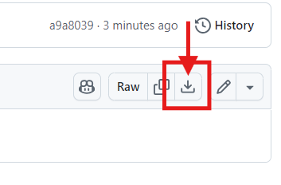

# Install Prediction App and download disease data for CHAP Core
Prediction App offers the possibility to download disease data from DHIS2 into a CHAP Core-supported format.


## Install Prediction App
To install the Prediction App, follow these steps:

1. Download Prediction App [from here](static/prediction-app-1.0.0.zip), by clicking "Download raw file" 



2. Install the app manually on your DHIS2 instance ([Learn how to install a custom DHIS2 app](https://dhis2-app-course.ifi.uio.no/learn/dhis2/app-development-guides/build-publish-app-platform-app/manual-install/))

## Using the app to download data

- You can ignore the warning about "Missing Route" when you are using the app to download data.
- In this tutorial, you will only be using the "Select training data" page.
- Select one of the available models, as shown in the image below, and fill out the rest of the form.
- You need to have the population registered for a minimum of one DHIS2 year period or one DHIS2 month period for each orgUnit in the selected training period.
- Select only periods of the same type as the model supports. For example, "EWARS - monthly data" would only accept monthly data.
- Click "Download data" to download a JSON file that can be used with CHAP Core to train and predict.


### Important about selecting period
If your primary goal is to predict the number of cases (rather than to evaluate models), make sure you select the most recent completed period up to today. CHAP Core does not account for specific dates and treats each month's registrations equally. Therefore, it is crucial to ensure that the data you provide is complete. For example, if today's date is the 15th, the data for the current month is likely to be incomplete because it won't include information from the second half of the month. CHAP Core is not able to tell that the data belongs to an incomplete month and will count it as one full month of registration when it in reality is only 15 days. This will cause inaccurate predictions.

## Evaluate and predict with CHAP Core
Go to [Convert the JSON data into a CHAP-DataSet](https://github.com/dhis2/chap-core/blob/master/docs_source/tutorials/downloaded_json_data.rst#convert-the-json-data-into-a-chap-dataset) and use your downloaded JSON file to evaluate models and predict.

The JSON-file should look similar to this:
```json
{
  {
  "model_id": "EWARS-month",
  "features": [
    {
      "featureId": "population",
      "dhis2Id": "gJkrZH2vV8k",
      "data": [
        //removed for readability  
      ]
    },
    {
      "featureId": "disease",
      "dhis2Id": "GPEAQwddr16",
      "data": [
        //removed for readability  
      ]
    }
  ],
  "orgUnitsGeoJson": {
    "type": "FeatureCollection",
    "features": [
      //removed for readability  
    ]
  }
}
}
```